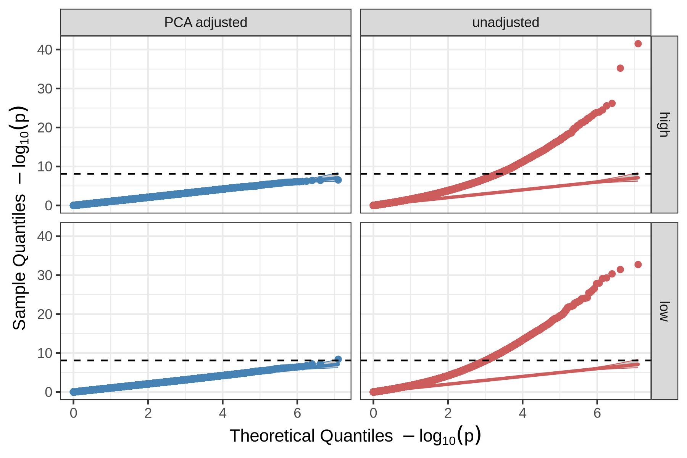

# Population structure confounds regression-based epistasis detection

The repository is part of the Supplementary Information for the paper "Are we making the right assumptions about epistasis?" by Balvert et al. (2024), XXXX.

The main script is `population_structure_pipeline.py` which simulates genotypes from a coalescent model with samples from four populations, and runs a regression-based epistasis analysis both with and without PCA based correction for population structure.

## Resulting figure



Caption: QQ plots for PLINK pairwise epistasis analysis on simulated null data with population structure and no true epistatic effects (interactions), i.e. only additive contributions (main effects), and trait heritability of 0.5 (Details of simulation in Supplementary Methods). Comparison of analysis corrected for population structure with 20 PCs (blue) and uncorrected for population structure (red) shows that population structure also leads to inflation of small p-values and a large number of false positives in regression- based genome-wide association studies that model epistasis as a pairwise interaction term. The dotted horizontal line is the significance threshold after Bonferroni correction. Phenotype adjustment here is performed by regressing the phenotype against 20 PCs in a multiple linear regression model and using the residuals as the “adjusted phenotype”. The facets labelled as “high” and “low” correspond to 1000 and 100 true causal variants respectively with additive-only contributions to trait variance.

# Requirements and usage

The code relies on commandline tools such as [PLINK](https://www.cog-genomics.org/plink/) and [GCTA](https://yanglab.westlake.edu.cn/software/gcta/#Overview) as well as Python and R.

## Software Requirements:
- [PLINK](https://www.cog-genomics.org/plink/) v1.90b7 
- [GCTA](https://yanglab.westlake.edu.cn/software/gcta/#Overview)  v1.94.1
- Python >= 3.9
- R >= 4.3
- recommended: [Poetry](https://python-poetry.org/) for managing python dependencies

## Python Dependencies:
The python dependencies are specified in the `pyproject.toml` file. The python dependencies can be managed with [Poetry](https://python-poetry.org/). To install the dependencies, run the following command in the root directory of the repository:

```bash
poetry install --no-root
```
   
## R Dependencies:

Install the R dependencies by running the following command in an R console:

```R
install.packages(
  c(
    "argparse",
    "dplyr",
    "ggplot2"
  )
)
```

## Usage:

After installing the dependencies, the pipeline can be run with the following command in the root directory of the repository:

```bash
mkdir data
python population_structure_pipeline.py
```

The generated files are saved to the `data` directory.
